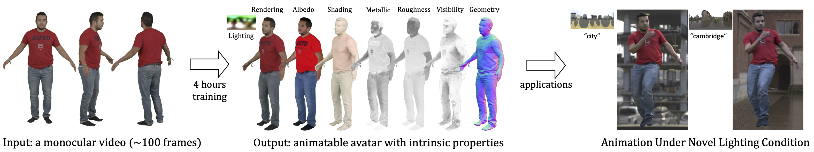

# IntrinsicAvatar: Physically Based Inverse Rendering of Dynamic Humans from Monocular Videos via Explicit Ray Tracing
## [Paper](https://arxiv.org/abs/2312.05210) | [Project Page](https://neuralbodies.github.io/IntrinsicAvatar/)

 

This repository contains the implementation of our paper
[IntrinsicAvatar: Physically Based Inverse Rendering of Dynamic Humans from Monocular Videos via Explicit Ray Tracing](https://arxiv.org/abs/2312.05210).

You can find detailed usage instructions for installation, dataset preparation, training and testing below.

If you find our code useful, please cite:

```bibtex
@inproceedings{WangCVPR2024,
  title   = {IntrinsicAvatar: Physically Based Inverse Rendering of Dynamic Humans from Monocular Videos via Explicit Ray Tracing},
  author  = {Shaofei Wang and Bo\v{z}idar Anti\'{c} and Andreas Geiger and Siyu Tang},
  booktitle = {IEEE Conf. on Computer Vision and Pattern Recognition (CVPR)},
  year    = {2024}
}
```

## Requirements
- This repository is tested on Ubuntu 20.04/CentOS 7.9.2009 with Python 3.10, PyTorch 1.13 and CUDA 11.6.
- NVIDIA GPU with at least 24GB VRAM. NVIDIA GeForce RTX 3090 is recommended.
- GCC/C++ 8 or higher.
- `openexr` library. Can be obtained on Ubuntu via `sudo apt install openexr`.


## Install
### Code and SMPL Setup
- Clone the repository
```bash
git clone --recursive https://github.com/taconite/IntrinsicAvatar.git
```
- Download `SMPL v1.0 for Python 2.7` from [SMPL website](https://smpl.is.tue.mpg.de/) (for male and female models), and `SMPLIFY_CODE_V2.ZIP` from [SMPLify website](https://smplify.is.tue.mpg.de/) (for the neutral model). After downloading, inside `SMPL_python_v.1.0.0.zip`, male and female models are `smpl/models/basicmodel_m_lbs_10_207_0_v1.0.0.pkl` and `smpl/models/basicModel_f_lbs_10_207_0_v1.0.0.pkl`, respectively. Inside `mpips_smplify_public_v2.zip`, the neutral model is `smplify_public/code/models/basicModel_neutral_lbs_10_207_0_v1.0.0.pkl`. Rename these `.pkl` files and copy them to subdirectories under `./body_models/smpl/`. Eventually, the `./body_models` folder should have the following structure:
```
data
 └-- SMPLX
    └-- smpl
       ├-- SMPL_FEMALE.pkl
       ├-- SMPL_MALE.pkl
       └-- SMPL_NEUTRAL.pkl
```

### Environment Setup
- Create a Python virtual environment via either `venv` or `conda`
- Install PyTorch>=1.13 [here](https://pytorch.org/get-started/locally/) based the package management tool you used and your cuda version (older PyTorch versions may work but have not been tested)
- Install tiny-cuda-nn PyTorch extension: `pip install git+https://github.com/NVlabs/tiny-cuda-nn/#subdirectory=bindings/torch`
- Install other packages: `pip install -r requirements.txt`
- Set `PYTHONPATH` to the current working directory: `export PYTHONPATH=${PWD}`


## Dataset Preparation
Please follow the steps in [DATASET.md](DATASET.md).


## Training
Training and validation use [wandb](https://wandb.ai/site) for logging, which is free to use but requires online register. If you don't want to use it, append `logger.offline=true` to your command.

To train on the `male-3-casual` sequence, use the following command:
```
python launch.py dataset=peoplesnapshot/male-3-casual tag=IA-male-3-casual
```
Checkpoints, code snapshot, and visualizations will be saved under the directory `exp/intrinsic-avatar-male-3-casual/male-3-casual@YYYYMMDD-HHMMSS`


## Testing
To test on the `male-3-casual` sequence for relighting on within-distribution poses, use the following command:
```
python launch.py mode=test \
    resume=${PATH_TO_CKPT} \
    dataset=peoplesnapshot/male-3-casual \
    tag=IA-male-3-casual \
    model.global_illumination=false \
    model.add_emitter=true  # set to false if you are doing quantitative evaluation
```
To test on the `male-3-casual` sequence for relighting on out-of-distribution poses, use the following command:
```
python launch.py mode=test \
    resume=${PATH_TO_CKPT} \
    dataset=animation/male-3-casual \
    light=envlight_tensor \
    tag=IA-male-3-casual \
    model.render_mode=light \
    model.global_illumination=false \
    model.samples_per_pixel=1024 \
    model.add_emitter=true  # set to false if you are doing quantitative evaluation
```

## TODO
- [ ] Blender script to render SyntheticHuman-relit from the SyntheticHuman dataset
- [ ] Proper mesh export code
- [ ] Unified dataset loader for PeopleSnapshot (monocular), RANA/SyntheticHuman (synthetic), and ZJU (multi-view)

## Acknowledgement
Our code structure is based on [instant-nsr-pl](https://github.com/bennyguo/instant-nsr-pl). The importance sampling code (`lib/nerfacc`) follows the structure of [NeRFAcc](https://github.com/nerfstudio-project/nerfacc). The SMPL mesh visualization code (`utils/smpl_renderer.py`) is borrowed from [NeuralBody](https://github.com/zju3dv/neuralbody). The LBS-based deformer code (`models/deformers/fast-snarf`) is borrowed from [Fast-SNARF](https://github.com/xuchen-ethz/fast-snarf) and [InstantAvatar](https://github.com/tijiang13/InstantAvatar). We thank authors of these papers for their wonderful works which greatly facilitates the development of our project.
